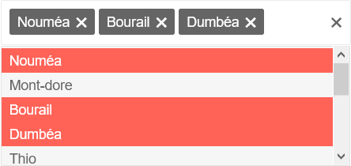
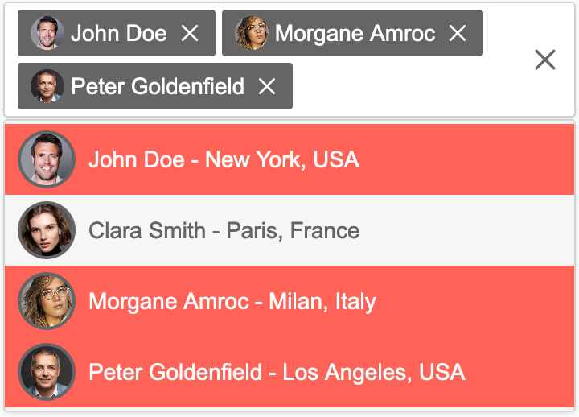

# Iconic Multiselect

[](https://opensource.org/licenses/MIT) [](https://github.com/sidneywm/iconic-multiselect)

<p align="center"><b>A multiselect component written in pure JavaScript - Also compatible with IE11</b></p>

<p align="center">Default template:</p>

<p align="center">
  
</p>

<p align="center">Custom template:</p>

<p align="center">
  
</p>

### :rocket: [Try live demo](https://sidneywm.github.io/iconic-multiselect/)

## Getting Started

### 1. Link the required files

Firstly, the script and the CSS stylesheet need to be included in your HTML file. The `multi-select.css` file can be modified to change the default theme of the component.

```html
<head>
  <link rel="stylesheet" href="multi-select.css" type="text/css" />
</head>

<script src="multi-select.js" type="text/javascript"></script>
```

### 2. Create a select tag

Secondly, within your HTML file, create a `<select>` tag which you want to turn into a multiselect. Do not forget to set an `id` on your `<select>` tag.
If the attribute `selected` is set in one (or more) of your options, the option(s) will be automatically added to the selected options at initialization.

```html
<select id="foods">
  <option value="bread">Bread</option>
  <option selected value="cereal">Cereal</option>
  <option selected value="pasta">Pasta</option>
  <option value="rice">Rice</option>
  <option value="meat">Meat</option>
  <option value="fish">Fish</option>
</select>
```

### 3. Initialize the Iconic Multiselect component

Finally, target the `id` of your `<select>` tag in the options and initialize the component with the `.init()` method. You may also specify further options. ([see configuration](#configuration))

```html
<script type="text/javascript">
  const multiSelect = new IconicMultiSelect({
    select: "#foods",
  });

  multiSelect.init();
</script>
```

## Configuration

### 1. Overview

| Option       |       Default       |    Type    |
| :----------- | :-----------------: | :--------: |
| data         |        `[]`         | `Object[]` |
| itemTemplate |       `null`        |  `string`  |
| noData       |  `No data found.`   |  `string`  |
| noResults    | `No results found.` |  `string`  |
| placeholder  |     `Select...`     |  `string`  |
| select\*     |       `none`        |  `string`  |
| textField    |       `null`        |  `string`  |
| tagTemplate  |       `null`        |  `string`  |
| valueField   |       `null`        |  `string`  |

\* This option is compulsory

#### `data*`

The component can be configured with data set in the configuration fields. It must be an `Array` of `Objects`.
If a property named `selected` is set to `true` in one of your object, the option will be automatically added to the selected options at initialization.

#### `itemTemplate`

This option allows to define a custom template for the items rendered in the popup list.
Custom item template can contains placeholders. These are indicated with a dollar sign and curly braces (`${your_item_property_name}`).

#### `noData`

Text to display if there is no data found in the `<select>` tag or in the data field.

#### `noResults`

Text to display if there is no results when the option list is filtered.

#### `placeholder`

Text to display in the input placeholder.

#### `select`

The `<select>` tag from which the component is initialized.

#### `tagTemplate`

This option allows to define a custom template for the tags rendered in the input list.
Custom tag template can contains placeholders. These are indicated with a dollar sign and curly braces (`${your_item_property_name}`).

#### `textField`

The field of the data object that provides the text content.

#### `valueField`

The field of the data object that provides the value.

\* **IMPORTANT:** When `data` is provided, `valueField` and `textField` should also be set.

### 2. Example

```html
// Default template
<script type="text/javascript">
  const multiSelect = new IconicMultiSelect({
    customCss: true,
    data: [
      { valueName: "bread", itemName: "Bread" },
      { valueName: "rice", itemName: "Rice" },
      { valueName: "pasta", itemName: "Pasta" },
    ],
    noData: "No food item found.",
    noResults: "No results found in this list.",
    placeholder: "Select a food item...",
    select: "#foods",
    textField: "itemName",
    valueField: "valueName",
  });
</script>

// Custom template
<script type="text/javascript">
  const multiSelect = new IconicMultiSelect({
    select: "#employees",
    data: [
      { text: "John Doe", value: "john_doe", imageUrl: "face1.png", location: "New York, USA" },
      { text: "Clara Smith", value: "clara_smith", imageUrl: "face2.jpg", location: "Paris, France" },
      { text: "Morgane Amroc", value: "morgane_amroc", imageUrl: "face3.png", location: "Milan, Italy" },
      { text: "Peter Goldenfield", value: "peter_goldenfield", imageUrl: "face4.jpg", location: "Los Angeles, USA" },
    ],
    valueField: "value",
    textField: "text",
    tagTemplate:
      '<div class="demo-tag-template"><span class="demo-tag-template__img" style="background-image: url(./${imageUrl});"></span> ${text}</div>',
    itemTemplate:
      '<div class="demo-template"><span class="demo-template__img" style="background-image: url(./${imageUrl});"></span> ${text} - ${location}</div>',
    placeholder: "Select an employee...",
  });
</script>
```

## Methods

#### `.init()`

Initialize the component with all its settings.

#### `.subscribe()`

Listen for all events.

Example:

```javascript
JavaScript: 

multiSelect.subscribe(function (event) {
  console.log(event);
});
```

```console
Console:

Object : { action: "ADD_OPTION", value: "pasta", selection: (1) [...] }
```

## Contributing

Iconic Multiselect is an open-source project. Contributions of any kind are welcome and appreciated. Feel free to open an issue or request a feature. Pull requests are also welcome.

## Author

- [Sidney Wimart](https://github.com/sidneywm)

## License

This project is open source and available under the [MIT License](LICENSE).
