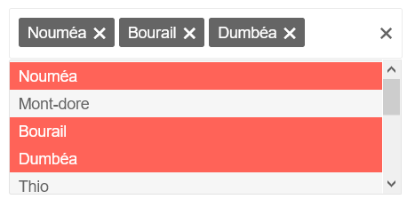

# Iconic Multiselect

 

A multiselect component written in pure JavaScript - Also compatible with IE11

## Author

- [Sidney Wimart](https://github.com/sidneywm)

## License

This project is open source and available under the [MIT License](LICENSE).